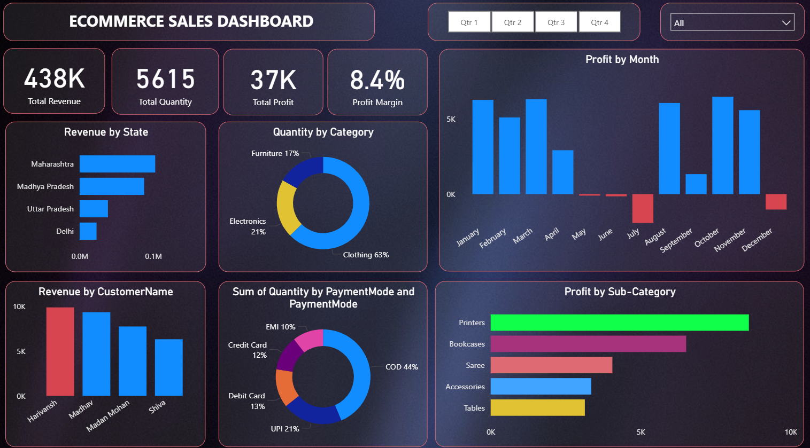

# E-Commerce-Sales-Dashboard
Power BI dashboard analyzing e-commerce sales performance using DAX measures and interactive visualizations.
## 📊 Dashboard Preview

## 🔧 Tools & Skills Used
- Power BI
- DAX (Measures for Total Revenue, Total Profit, Profit Margin)
- Data Modeling
- Data Cleaning
- Data Visualization

## 📊 Key Business Insights
- Maharashtra generated the highest revenue.
- Clothing category contributed the largest share of total quantity (63%).
- Profit declined significantly in July.
- COD was the most used payment method (44%).
